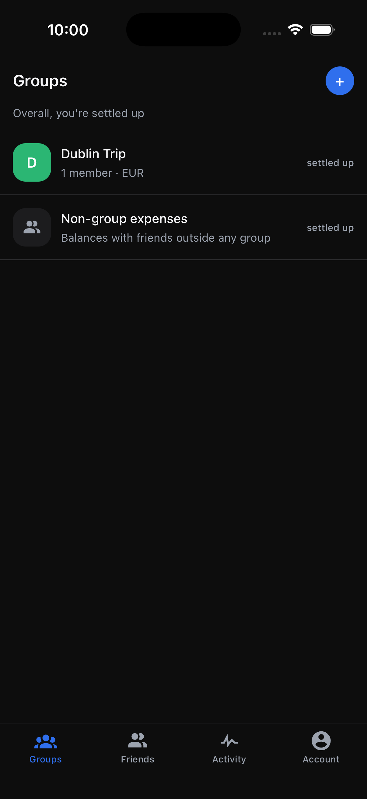
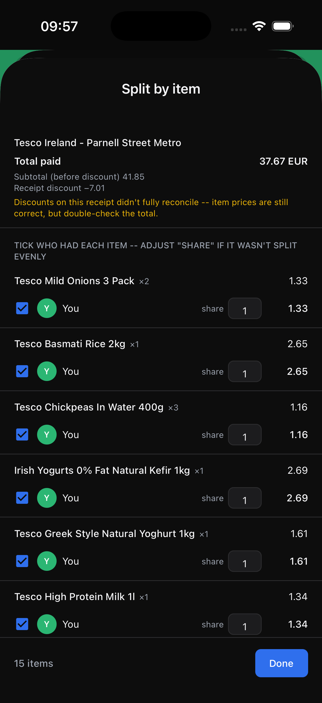

# BillBuddy

A Splitwise-style expense-splitting app with AI-powered receipt scanning: photograph a bill and it's automatically broken down into itemized shares, ready to split with a group.

**Status: in active development.**

## Screenshots

<table>
  <tr>
    <td></td>
    <td></td>
    <td></td>
  </tr>
  <tr>
    <td align="center">Groups overview</td>
    <td align="center">AI receipt scan &rarr; itemized split</td>
    <td align="center">Group expense feed</td>
  </tr>
</table>

## How the bill scanner works

Photograph a receipt and Claude's vision API reads it via structured tool-use: merchant, per-item price, quantity, and any discounts. Claude only transcribes what's printed — it never does arithmetic. All the math (netting per-item discounts into prices, merging duplicate lines, scaling items to sum exactly to the receipt total) runs deterministically in the backend, so the itemized split is always guaranteed to reconcile to the amount actually charged. See [`apps/backend/docs/bill-scanner.md`](apps/backend/docs/bill-scanner.md) for the full design.

## Tech stack

**Backend** — Java, Spring Boot, Spring Security, Spring Data JPA, PostgreSQL, JWT (access + refresh token rotation), Docker, Claude API (Anthropic), Maven, JUnit/Mockito

**Frontend** — TypeScript, React Native (Expo), React Navigation, Zustand, Axios, NativeWind/Tailwind

## Features

- Auth: signup/login, JWT with silent refresh, email verification, password reset, Google OAuth
- Groups and friends, with email and shareable-link invites (deep-linked into the app)
- Four expense-split types: equal, exact, percentage, and itemized-by-receipt-line
- Multi-currency expenses with live FX-rate lookups
- AI receipt scanning (see above) with a full-screen receipt viewer
- Balances, settlements, and recurring expenses

## Documentation

Backend feature docs (endpoint reference, error codes, design notes):

- [Backend overview](apps/backend/docs/README.md)
- [Auth](apps/backend/docs/auth.md)
- [Bill Scanner](apps/backend/docs/bill-scanner.md)
- [Expenses](apps/backend/docs/expenses.md)
- [Friends](apps/backend/docs/friends.md)
- [Groups](apps/backend/docs/groups.md)
- [Notifications](apps/backend/docs/notifications.md)
- [Recurring expenses](apps/backend/docs/recurring-expenses.md)
- [Settlements](apps/backend/docs/settlements.md)
- [Storage](apps/backend/docs/storage.md)

Frontend conventions: [`apps/frontend/docs/frontend-architecture.md`](apps/frontend/docs/frontend-architecture.md)

## Running it locally

```bash
cp .env.example .env   # fill in the placeholder values
docker compose -f docker/docker-compose.yml up -d
```

The API comes up on `http://localhost:8080` (Swagger UI at `/swagger-ui.html`). Then, from `apps/frontend`:

```bash
npm install
npx expo run:ios      # or: npx expo run:android
```
